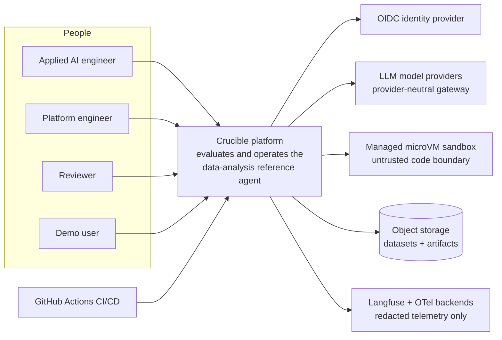
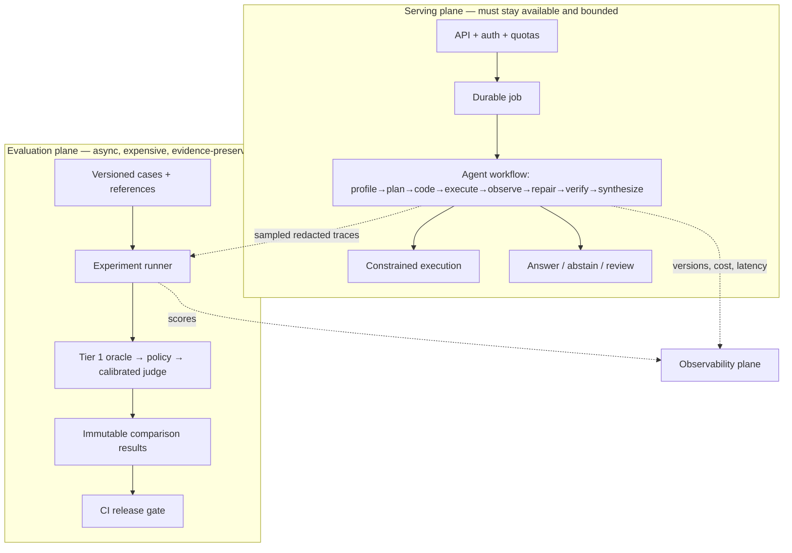
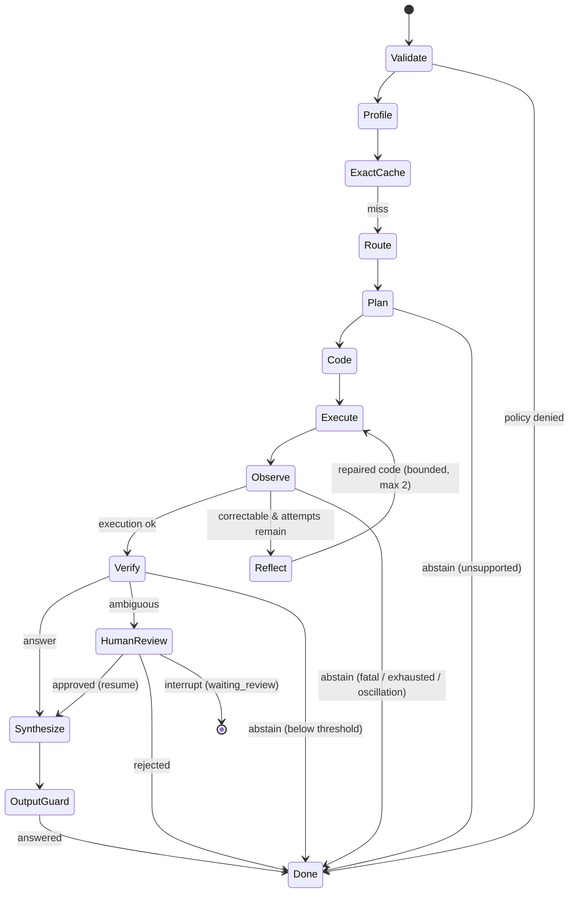

# Crucible — C4 Level 1 Context (with plane separation)

Status: Phase 0 baseline · Date: 2026-07-14

## System context

## Plane separation (the core architectural claim)

Rules encoded by this diagram:

1. The serving plane answers a request; the evaluation plane judges *changes to the
   agent*. They fail independently — analytics delay never degrades serving.
2. The evaluation plane never silently rewrites baselines.
3. The sandbox is outside the API/worker trust boundary (see ADR-003 and the threat model).
4. Only redacted, hashed, access-controlled content crosses into observability providers.

## Agent graph (Phase 4)

The durable data-agent is an explicit typed graph (ADR-008): each node has one
job, a typed output, and emits a trace event; the runner checkpoints after every
node so a worker restart resumes from the last completed node.

Terminal reasons map to the Phase 2 run state machine; `agent_runs` stays the
single source of truth for status, and `agent_checkpoints` holds only what is
needed to resume. Model plan/code/repair use a provider-neutral gateway
(`fake` deterministic backend by default; OpenAI-compatible contract for real
models); generated code always runs in the Phase 3 sandbox.

Container- and component-level diagrams (C4 L2/L3) beyond this are created as the
corresponding services come into existence — not speculated here.
