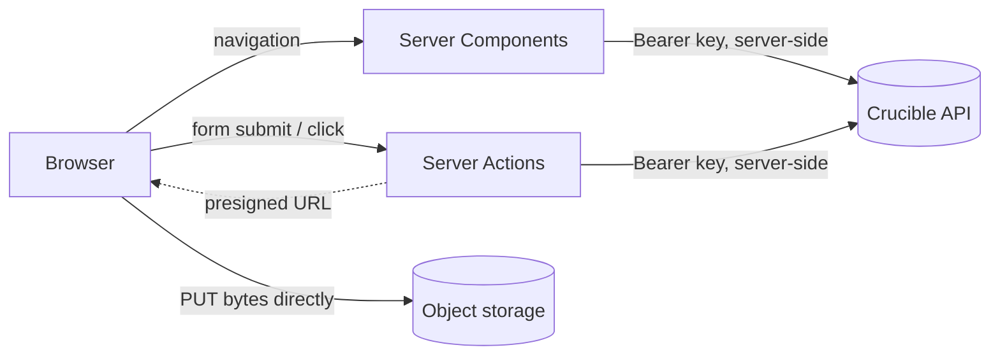

# Web frontend architecture (Phase 7)

Status: Phase 7 · Related: [c4-context.md](c4-context.md) ·
[product-tour.md](../operations/product-tour.md) ·
[local-development.md](../operations/local-development.md)

The web app (`apps/web`) is the product surface: it makes the platform legible to
users and reviewers without any internal tooling. It is a Next.js App Router app
that consumes the same public API as any other client, plus a small design
system (`packages/ui`).

## The credential is the session

There is no browser login flow in v1. The web app authenticates to the API with
an **org-scoped API key**, held in a server-side environment variable
(`CRUCIBLE_API_KEY`) and used exclusively from Server Components, Server Actions,
and Route Handlers. The key never reaches the browser — a credential in client JS
is a credential in the user's clipboard. Because the key is org-scoped and the
API enforces tenant isolation on every request, the UI cannot read or mutate
another tenant's data; the frontend reflects the API's authorization, it never
invents its own (see the Settings page, which renders `/v1/me`).

Full multi-user OIDC browser sign-in is deliberately deferred; the API already
validates OIDC JWTs, so it is an additive change, not a rework.

## Data flow

- **Reads** happen in Server Components (`lib/api.ts`, marked `server-only`). Each
  page fetches with `cache: "no-store"` and `dynamic = "force-dynamic"` — this is
  live operational data, not a static site.
- **Writes** happen only through Server Actions (`app/actions.ts`). They return a
  discriminated `ActionResult` (`{ ok: true, data } | { ok: false, error }`) so a
  client component renders a precise message instead of a framework error, and
  they `revalidatePath` the affected routes.
- **Uploads** never pass through the API or the web server: the Server Action
  mints a presigned URL, the browser PUTs the bytes straight to object storage,
  computes the SHA-256, and the Server Action completes the version. Content is
  identity — the API re-hashes the stored bytes and rejects a mismatch.

## Design system (`packages/ui`)

A workspace package of framework-agnostic React components plus one token
stylesheet. It ships as TypeScript **source** (no build step); Next transpiles it
via `transpilePackages`. Highlights:

- **Tokens** (`tokens.css`): colour/space/radius/type as CSS custom properties,
  themed for light and dark via `prefers-color-scheme` with a `data-theme`
  override that wins in both directions (the `ThemeToggle` sets it).
- **Components**: `StatusBadge`, `SeverityTag`, `GateBadge`, `DataTable`,
  `Panel`, `MetricCard`/`MetricGrid`, `Callout`, `KeyValue`, `Mono`, `Tag`,
  `Pre`, and the observability views `Trace` and `ConfigView`.

## Accessibility

- Semantic landmarks (`<header>`, `<nav aria-label>`, `<main id="main">`), a
  skip-to-content link, and a single `<h1>` per page.
- Status is never colour-only: every badge pairs a coloured dot with a text
  label (WCAG 1.4.1); alerts use `role="alert"`.
- Keyboard-first: standard controls, visible `:focus-visible` outlines
  everywhere, no positive `tabindex`.
- Responsive: the layout is fluid, wide tables scroll inside their panel (never
  the page body), and the key/value grid collapses to one column on narrow
  viewports. `prefers-reduced-motion` is honoured.

## Routes

| Route | Purpose |
|---|---|
| `/` | Landing + live API health + the five-step journey |
| `/dashboard` | Reliability: alerts, KPIs, terminal states, failure taxonomy |
| `/datasets` | Upload (direct-to-storage) + immutable versions |
| `/runs` | Start a run; list runs |
| `/runs/[id]` | Answer + provenance, verification, **trace**, config, timeline, attempts; cancel |
| `/reviews` | Claim → rubric → approve/reject, in place |
| `/evaluations` | Suites + latest comparison + **report export** (JSON/Markdown) |
| `/settings` | Identity, permissions, API keys (mirrors `/v1/me`) |
