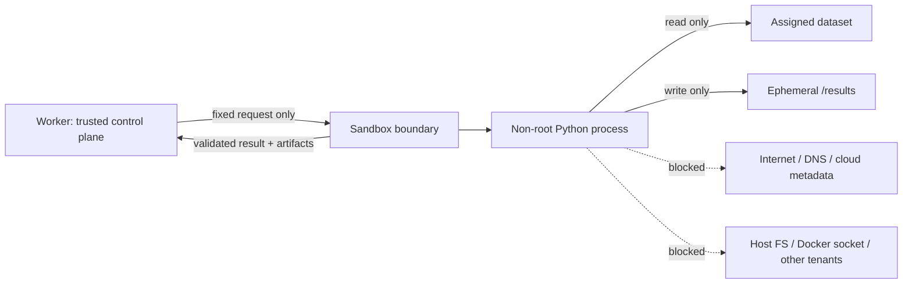

# Sandbox Design and Containment Evidence

Status: Phase 3 · Date: 2026-07-15 · Owner: project owner
References: master plan §9, ADR-003, threat model T3/T4/T11

Model-generated code is hostile until contained (charter principle 4). This
document describes the execution boundary and links every control to the canary
that proves it.

## 1. Trust boundary

The request carries only a program, one dataset, and host-set limits. There is
**no field** for an image, mount, network flag, capability, package, or
environment variable — a hostile program cannot ask for a capability it was not
given, because the protocol has nowhere to put the request
(`test_request_schema_has_no_sandbox_config_fields`).

## 2. Backends (ADR-003)

| Environment | Backend | Notes |
|---|---|---|
| Unit / integration tests | `FakeExecutor` | Never executes code; interprets directives to drive workflow branches. |
| Local development | `DockerExecutor` | The hardened runner below. Docker is dev-only; the compose worker has no Docker socket. |
| Staging / production | `MicroVMExecutor` | Managed microVM (E2B-class). Deny-by-default: no weaker fallback if unconfigured. |

The compose worker defaults to `fake` precisely because giving it a Docker
socket would violate the boundary (ADR-003). The Docker canaries run from the
host in the test suite.

## 3. Applied controls → proving canary

Every control is set explicitly in `DockerExecutor._container_config`; the
in-sandbox harness (`infra/docker/runner/harness.py`) adds per-process limits.

| Control | Mechanism | Canary (`tests/sandbox/test_canaries.py`) |
|---|---|---|
| No network egress | `network_disabled`, `network_mode=none` | `test_outbound_tcp_is_blocked` |
| No DNS | same | `test_dns_resolution_is_blocked` |
| No cloud metadata (169.254.169.254) | same | `test_cloud_metadata_endpoint_is_unreachable` |
| No Docker socket | nothing mounts it | `test_docker_socket_is_not_present` |
| Read-only root filesystem | `read_only=True` | `test_root_filesystem_is_read_only` |
| Only the assigned dataset visible | single read-only input mount | `test_sandbox_exposes_only_the_assigned_dataset` |
| No host secrets in env | harness passes a minimal child env | `test_no_host_secrets_in_environment` |
| Non-root | image `USER 10001`, host `user=10001:10001` | `test_program_runs_as_non_root` |
| No privilege escalation | `cap_drop=ALL`, `no-new-privileges` | `test_privilege_escalation_is_denied` |
| Memory cap (no swap) | `mem_limit == memswap_limit` | `test_memory_bomb_is_contained` |
| CPU / wall-clock cap | `nano_cpus`, host `wait(timeout)` + kill, RLIMIT_CPU | `test_cpu_spin_is_killed_by_wall_clock` |
| Process cap | `pids_limit` | `test_fork_bomb_is_contained` |
| File-size cap | RLIMIT_FSIZE (harness) | `test_file_size_bomb_is_contained` |
| Total output cap | host-side `collect_results` | `test_output_bomb_is_rejected_by_total_cap` |
| Malicious artifact rejection | extension allowlist, no symlinks | `test_malicious_artifact_is_dropped`, `test_symlink_artifact_is_rejected` |
| Result validation | JSON-object contract, size cap | `test_non_object_result_is_invalid`, `test_missing_result_is_reported` |
| Fresh + destroyed per attempt | `create`→`start`→`remove(force=True)` | `test_container_is_destroyed_after_the_run` |

Latest run: **20 canaries, all passing** (2026-07-15, Docker 29.6.1).

## 4. Result path (why stdout is never trusted)

The untrusted program writes `/results/result.json`. The trusted harness — a
separate process the untrusted subprocess cannot forge writes for — records the
authoritative `/results/manifest.json`. The host reads both from the results
mount after the container exits and validates everything with
`collect_results` before anything is published: extension allowlist, no
symlinks, per-file and total-size caps, and a JSON-object result contract. The
program's stdout is captured for diagnostics only, never parsed as the answer.

## 5. Known limitations (carried forward)

- The Docker backend is for local development only. Docker Desktop on Windows
  applies its default seccomp profile; a custom seccomp profile is supported via
  configuration but is not required for the controls above. Production uses a
  managed microVM with stronger isolation.
- A read-write bind mount for `/results` has no hard host-side size quota; the
  per-file RLIMIT_FSIZE and the total-output cap bound it, and production uses
  provider-enforced quotas.
- Digest-pinning the runner base image is a Phase 9 hardening task.
