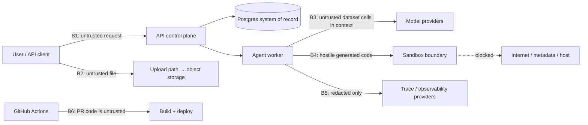

# Crucible Initial Threat Model v0.1.0

Status: Phase 0 baseline · Date: 2026-07-14 · Framework inputs: OWASP LLM Top 10, OWASP Agentic Applications guidance

Scope: every trust boundary that exists once the v1 workload ships. Each boundary maps
to controls **and** to test evidence — a control without a planned test is not counted.

## 1. Trust boundaries

## 2. Asset × threat × control × test matrix

| # | Asset / boundary | Threat | Core controls | Test evidence (phase) |
|---|---|---|---|---|
| T1 | User question (B1) | Direct prompt injection; instruction abuse | Question is data; tool capabilities cannot be expanded by text; strict typed tool schema | Injection cases in safety suite (P5); denied-tool audit (P4) |
| T2 | Dataset cells (B2/B3) | **Indirect prompt injection** in cells; formula/parser abuse; PII exposure | Every cell is untrusted data in a delimited channel, never elevated to instructions; size/type limits before parsing; PII scan before third-party calls | Malicious-cell behavioral tests: no tool/policy change, no exfiltration (P5) |
| T3 | Generated code (B4) | Host escape, exfiltration, resource exhaustion, secret theft | MicroVM/dedicated boundary in prod; fixed pinned image; non-root; read-only dataset; no network/DNS/metadata; no Docker socket/host mounts/privileged mode; CPU/mem/proc/disk/wall-clock caps; fresh sandbox per attempt; **model never chooses image, flags, mounts, or packages** | Escape/egress/resource/secret canaries all fail closed (P3); manual review |
| T4 | Sandbox control plane | Agent-influenced launcher config; control-credential leakage | Backend constructs fixed config; provider credentials isolated from runner; no secrets mounted | Environment/filesystem secret-search canary (P3) |
| T5 | Tenant data (DB/storage) | Cross-tenant access (IDOR), retention failure | Org-scoped authz in every use case and repository query; storage IAM per tenant; opaque IDs; audit events; deletion workflow | Guessed-ID negative tests; cross-tenant artifact-grant substitution → 403 (P2/P3) |
| T6 | API (B1) | Auth bypass, replay, upload abuse, rate-limit bypass | OIDC/JWT server-side validation; RBAC default-deny; idempotency keys; layered rate limits; WAF; presigned scoped upload URLs | Authz/IDOR/replay/oversize test suite (P2) |
| T7 | LLM context | Secret or cross-tenant data reaching a provider | No secrets in prompts; profile summaries instead of raw tables where possible; provider data path documented; redaction before calls where feasible | Context-content assertions in integration tests (P4) |
| T8 | Trace/eval store (B5) | Sensitive prompt/data leakage; forged feedback | Redaction before export; content hashes + access-controlled artifact links instead of raw data; retention policy; reviewer identity + append-only audit | Redaction tests; exported-payload field assertions (P6) |
| T9 | CI/CD (B6) | Secret theft, poisoned action, untrusted PR execution | OIDC short-lived creds; SHA-pinned actions; read-only default token; no `pull_request_target` with secrets; CODEOWNERS on workflows/infra/eval baselines; **generated code never runs on shared runners** | Workflow lint + permissions review (P1/P9) |
| T10 | Supply chain | Vulnerable dependency/image | Lockfiles; SBOM; CodeQL/Semgrep/Trivy/Gitleaks; signed images; Dependabot/Renovate cadence | Scan gates in CI (P1→P9) |
| T11 | Model output | Malicious artifacts (HTML/JS/SVG/zip-bomb), schema spoofing | Strict artifact parser; MIME/path validation before publishing; UI escaping; download disposition | Hostile-artifact test set (P3/P7) |
| T12 | Memory/context poisoning | Poisoned long-term memory | **No cross-user memory in v1** (architectural elimination); future retrieval corpus is versioned, tenant-scoped, poison-tested | Scope check: feature absent (P0 decision) |

## 3. Data classification

| Class | Examples | Default handling |
|---|---|---|
| Public synthetic fixture | `evals/fixtures/*` | Committed to repo; only class allowed in eval fixtures |
| Customer confidential | Uploaded datasets, results | Default class for uploads; encrypted, tenant-scoped, retained per policy |
| Personal data | PII inside uploads | Minimize; redact/tokenize before third-party providers; deletion workflow |
| Restricted secret | API keys, provider creds, signing keys | Secret Manager only; never in prompts, images, traces, or repo |

## 4. Standing rules

1. A failed code run is **never** fixed by granting more sandbox access, time, or resources.
2. No untrusted input (question, cell, model output) influences sandbox configuration, tool choice, or credentials.
3. Egress exceptions require an ADR, an allowlist, per-run audit, and user-visible disclosure. v1 has none.
4. Eval fixtures must never contain production data or credentials.
5. Injection suspicion is terminal — logged, audited, never retried.

## 5. Implemented controls by phase

### Phase 2 — identity and data plane (2026-07-14)

| Threat | Control now in place | Evidence |
|---|---|---|
| T5 cross-tenant access | Every repository read takes `organization_id` explicitly; cross-tenant reads return **404, not 403**, so IDs cannot be probed for existence. Object keys are tenant-prefixed (`org/{id}/…`). | `tests/security/test_tenant_isolation.py` — 20 cases: read, list, cancel, complete-upload, download-URL minting, run creation, key revocation, and header-based tenant switching |
| T6 API auth | OIDC JWT (signature/issuer/audience/expiry) or Argon2id-hashed API keys; expiry and revocation take effect immediately; RBAC is default-deny and checked inside each use case, not at the route. | `test_jwt_verifier.py`, `test_api_keys.py`, `test_identity_policy.py` |
| Privilege escalation | An API key can never exceed its creator's permissions, and `scopes` only ever intersect a role. `owner` holds an exclusive `org:manage` permission, so `admin` is strictly below it. | `test_admin_cannot_mint_a_key_beyond_their_own_permissions` |
| T2 hostile uploads | Size/type/extension policy is enforced **before** a presigned URL exists; the parser (not the declared content type) is the authority; row/column caps guard decompression bombs; a client-declared SHA-256 is re-computed from the stored bytes, and a mismatch is a terminal `invalid`. | `test_profiler.py`, `test_declared_hash_must_match_the_uploaded_bytes` |
| Audit evidence | Denials (401 and 403) are written in their **own transaction** — the request's session is rolled back when auth fails, so an audit row attached to it would vanish exactly when it matters. Download-URL issuance is audited. | `test_failed_authentication_is_audited`, `test_sensitive_actions_are_audited` |
| Unbounded consumption | Per-principal rate limits; expensive routes **fail closed** when the limiter is unavailable rather than admitting unaccounted work. | `RateLimit` in `apps/api/.../dependencies.py` |

**Known gap carried forward:** rate limits are per-principal only. Per-organization
token/cost budgets arrive with Phase 8, and unauthenticated IP-level limiting is a
WAF concern in Phase 9.

### Phase 3 — isolated execution and safety canaries (2026-07-15)

The execution boundary for model-generated code (threat T3/T4/T11) is built and
proven. Full detail and the control-to-canary matrix live in
[docs/security/sandbox.md](sandbox.md); summary:

| Threat | Control now in place | Evidence |
|---|---|---|
| T3 host escape / RCE | Fixed hardened runner: non-root, all caps dropped, no-new-privileges, read-only root, no Docker socket, private IPC. The model contributes only program source + dataset bytes; the request schema has no field for image/mount/network/caps/env. | `tests/sandbox/test_canaries.py` — privilege, docker-socket, read-only-root, schema canaries |
| T3 network exfiltration | `network_disabled` + `network_mode=none`: no egress, no DNS, no metadata endpoint. | outbound-TCP, DNS, cloud-metadata canaries (all blocked) |
| T3 resource exhaustion | Memory (no swap), CPU, pids, wall-clock, per-file (RLIMIT_FSIZE), and total-output caps; fresh container per attempt, force-destroyed. | memory/CPU/fork/file-size/output-bomb canaries (all contained) |
| T4 sandbox control plane | The backend constructs a fixed config; the compose worker has no Docker socket and defaults to the fake backend; the microVM adapter refuses a weaker fallback. | ADR-003; `executor_backend` default `fake` |
| T4 secret disclosure | The harness passes the child a minimal environment (two fixed paths); no host credential is inherited into the guest. | no-host-secrets canary |
| T11 malicious output | Extension allowlist, symlinks rejected, per-file/total caps, JSON-object result contract; stdout is never trusted as the result. | malicious-artifact, symlink, non-object-result, output-cap canaries |
| Cross-tenant data (T5 at the sandbox) | Only the single assigned dataset is mounted, read-only; no other file is visible. | assigned-dataset-only canary |

**Latest canary run:** 20/20 passing (Docker 29.6.1). **Known limitations**
(carried forward): the Docker backend is local-dev only; production microVM
provider integration and base-image digest pinning land in Phases 9–10.

### Phase 6 — observability, online eval, and human review (2026-07-18)

The trace/eval boundary (B5, threat T8) — everything that leaves the trust
boundary as telemetry — is built and enforced by a single redaction layer.
Detail in [docs/operations/observability.md](../operations/observability.md).

| Threat | Control now in place | Evidence |
|---|---|---|
| T8 sensitive prompt/data leakage on export | Nothing crosses B5 without `crucible.observability.redaction`: `redact_text` strips Crucible/provider secrets, credentialed URLs, and PII to typed markers; `export_safe_excerpt` redacts→bounds→hashes; `redact_payload` drops sensitive keys and redacts nested strings. Exported traces carry a salted one-way **tenant pseudonym**, never the raw org id, and never dataset contents. | `tests/unit/test_observability_redaction.py`; `test_metrics_and_trace_surface_a_terminal_run` asserts the raw org id never appears in an exported trace |
| T8 forged feedback | Human review is a claim→submit flow with an **exclusive** optimistic lock (`SELECT … FOR UPDATE` + unique `run_id`); only the claimant may submit; grades are typed `human` scores, never a correctness gate; every submission is audited (actor_type + actor_id). | `test_only_one_reviewer_can_claim_a_run`, `test_non_claimant_cannot_submit`, `test_claim_submit_records_scores_and_resolves_run` |
| T5 at the eval plane | The online sampler holds no user; it synthesizes a per-org system principal scoped to one organization, and the command enforces `EVAL_WRITE` and reads only that tenant's runs. Metrics/trace endpoints are org-scoped; a cross-tenant trace read returns 404. | `test_trace_is_tenant_isolated`, `test_online_sampler_records_deterministic_scores` |
| T7 secret/data reaching the judge | The judge is deny-by-default (`FakeJudge` in tests/dev; the OpenAI-compatible judge refuses without explicit config), scores **explanation quality only** (never correctness), and is used only when its held-out agreement is published and current. | [judge-calibration-report.md](../evaluation/judge-calibration-report.md); `tests/unit/test_eval_calibration.py` |

**Alert drill:** the SLO rules are pure functions over the metrics and are
exercised in `tests/unit/test_observability_metrics_trace.py`
(`test_alerts_fire_on_low_completeness_and_containment`,
`test_alerts_clear_when_healthy`), satisfying the DoD "an alert/runbook is
exercised." Runbooks: [alert-runbook.md](../operations/alert-runbook.md).

### Phase 8 — routing, exact cache, and budgets (2026-07-19)

Efficiency features introduce two new abuse surfaces: a cache that could leak
answers across boundaries, and a spend path that could run away. Detail in
[docs/operations/efficiency.md](../operations/efficiency.md).

| Threat | Control now in place | Evidence |
|---|---|---|
| T5 cache leakage (cross-tenant / cross-dataset / cross-config) | The cache key binds tenant + dataset *content* hash + full config signature + normalized question; the unique constraint and every SQL read are org-scoped (defense in depth); a new dataset version or any model/prompt/policy change is a disjoint key. | `test_key_binds_tenant_dataset_config_and_question`, `test_other_tenant_never_hits`, `test_cache_cannot_cross_tenants_even_with_identical_content`, `test_sql_cache_lookup_is_org_scoped_even_with_a_stolen_key` |
| Stale / forged cache entries | Hits re-validate the stored identity inputs; a mismatch is a counted *false hit*: the entry is invalidated and the run recomputed — a suspect entry is never served. Only fully verified answers are stored (never review/abstain outcomes). False hits surface on `/v1/metrics/cache` and the dashboard. | `test_false_hit_is_invalidated_and_recomputed`, `test_abstained_runs_are_never_cached`, `test_review_routed_answers_are_never_cached` |
| Semantic-cache scope creep | No flag exists; enabling it requires a new evaluation, ADR, and threat-model pass (master plan §12.3). | code inspection: `AnswerCache` is exact-match only |
| Runaway spend / cost-report gaming | Budget admission refuses before spending (audited denial); the ledger's reserves count in-flight work; settlement is idempotent under job re-delivery; escalated router calls bill the burned tier-1 call; unknown prices are `None`, never zero; synthetic prices are labeled in every report. | `test_admission_refuses_when_the_budget_is_exhausted`, `test_run_reserves_then_settles_actual_cost`, `test_usage_merge_with_unknown_cost_stays_unknown`, [router-experiment.md](../evaluation/router-experiment.md) |
| Quality loss hidden behind savings | The routed policy is gated by the same paired bootstrap the release gate uses, on a held-out suite through the real sandbox; a BLOCK fails the CLI. | `python -m crucible.evaluation router` exit code; committed report |

### Phase 9 — production CI/CD, staging, and delivery hardening (2026-07-20)

The delivery pipeline itself is a trust boundary (B6, threat T9): a compromised
workflow or a long-lived cloud key is a path straight to production. Detail in
[deployment-runbook.md](../operations/deployment-runbook.md) and
[infra/opentofu/README.md](../../infra/opentofu/README.md).

| Threat | Control now in place | Evidence |
|---|---|---|
| T9 long-lived cloud credentials | Deploys authenticate to GCP via GitHub OIDC / Workload Identity Federation — no static JSON key exists. The deployer SA is least-privilege and usable only from this repo on `main`; runtime API/worker SAs are separate and disjoint. | `infra/opentofu/modules/wif`, `deploy-staging.yml`/`promote-production.yml` (`id-token: write`, no key) |
| T9 poisoned / tampered actions | Every third-party action is pinned to a full commit SHA (not a moving tag); `zizmor` audits the workflows (pinning, template injection, credential persistence, least-privilege `permissions`) and gates PRs. | `zizmor` job in `security.yml` (clean); all `uses:` are `@<40-hex>` |
| T9 untrusted PR execution | Credential-bearing workflows run only on `push`/`workflow_dispatch`, never `pull_request`; protected GitHub environments require reviewer approval; `pull_request_target` is not used; checkout uses `persist-credentials: false`. | `deploy-staging.yml`, `promote-production.yml`, `rollback.yml` (`environment:` + triggers) |
| T9 supply-chain provenance | Images are built reproducibly from `uv.lock`, referenced by **digest**, cosign-signed (keyless), and carry a CycloneDX SBOM; production promotion **verifies the signature** before applying. | build/sign steps in `deploy-staging.yml`; `cosign verify` in `promote-production.yml` |
| T10 vulnerable deps/images/IaC | Layered scanning required on PRs: gitleaks (history), pip-audit (deps), CodeQL (SAST), Semgrep (registry + repo guardrail rules), Trivy (fs/vuln/misconfig), Checkov (IaC). | `security.yml`, `iac.yml`, `.semgrep.yml`, `trivy.yaml` |
| Unsafe migration rollback | Expand/contract discipline (semgrep forbids app-startup migrations); a code rollback is a traffic shift to the prior revision, always schema-compatible; DR is a data restore, never a schema downgrade. | [migration-runbook.md](../operations/migration-runbook.md), [rollback-runbook.md](../operations/rollback-runbook.md) |
| Deploy without a proven recovery path | A non-destructive DR drill (`scripts/dr_drill.sh`) plants a marker, backs up, restores into a scratch DB, and verifies — with committed evidence. Resilience game days (provider outage, queue loss, worker crash) run as gated tests. | `docs/operations/evidence/dr-drill-*.md`; `tests/integration/test_resilience_gameday.py` (3 drills) |

### Phase 10 — private beta, retention & the public edge (2026-07-21)

The private beta adds three surfaces: who may access at all (the allowlist), how
long data lives (retention/erasure), and the public internet edge. Detail in
[retention-policy.md](../operations/retention-policy.md) and
[data-processing-notice.md](../legal/data-processing-notice.md).

| Threat | Control now in place | Evidence |
|---|---|---|
| Unapproved access during beta | Access is an allowlist: only `active` organizations authenticate. A `suspended` org is refused at the authentication boundary for BOTH API keys and OIDC, on every endpoint — data retained, access denied. | `get_principal` status gate; `test_suspended_organization_is_refused_at_auth` |
| Data hoarding / minimization failure (T8-adjacent) | A daily retention job deletes terminal runs and their evidence past a window (per-tenant override); non-terminal runs are never reaped; audit and datasets are scoped out deliberately. | `crucible_worker.jobs.retention`; `test_retention_deletes_old_terminal_runs_and_keeps_recent`, `test_retention_never_reaps_a_non_terminal_run` |
| Erasure request mishandled | `purge-org` deletes all of one tenant's data + the org in one transaction, dry-run first; the org's key then fails to authenticate; other tenants untouched. | `scripts/admin.py purge-org`; `test_purge_organization_removes_all_tenant_data` |
| Public-edge attacks (T6) | Cloud Armor WAF: per-IP rate limiting, OWASP SQLi/XSS/LFI, Log4Shell; global HTTPS LB with managed TLS and HTTP→HTTPS redirect in front of the API. | `infra/opentofu/modules/waf`, `modules/https_lb`; Checkov 0 failed |
| Beta usage mistaken for correctness | Quality is the evaluation gate, not anecdote: the support/feedback loop routes quality complaints into eval cases; the weekly review reconciles telemetry with the gate. | [support-runbook.md](../operations/support-runbook.md); `scripts/weekly_review.py` |
| Sensitive real data in traces (privacy) | The redaction boundary (T8) and per-tenant scoping already ensure traces carry only a pseudonym, hashes, and bounded excerpts; the data-processing notice documents the boundary and the incident-notification duty. | [data-processing-notice.md](../legal/data-processing-notice.md); T8 controls (Phase 6) |

Cloud SQL hardening this phase (TLS-only, audit logging, pgAudit) and the
per-runtime-SA `serviceAccountUser` grant close the remaining IaC findings; the
OpenTofu passes `tofu validate` and Checkov with zero failures.

## 6. Review cadence

Threat model reviewed at each phase exit that adds a boundary (P2 data plane, P3
sandbox, P6 telemetry, P9 CI/CD hardening, P10 beta/edge) and after any security
incident.
